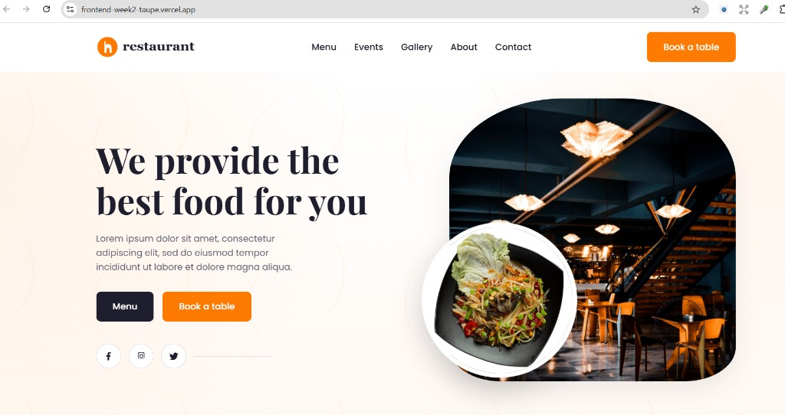
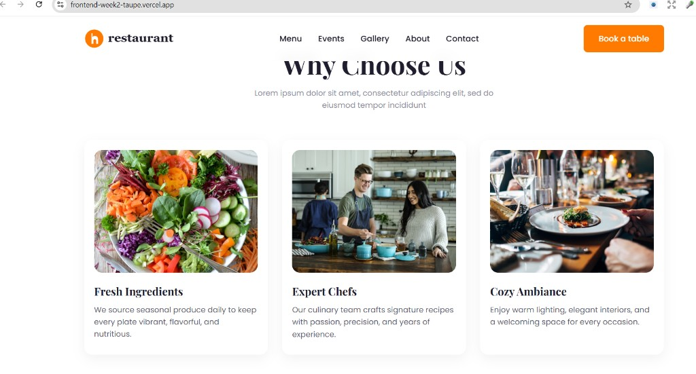
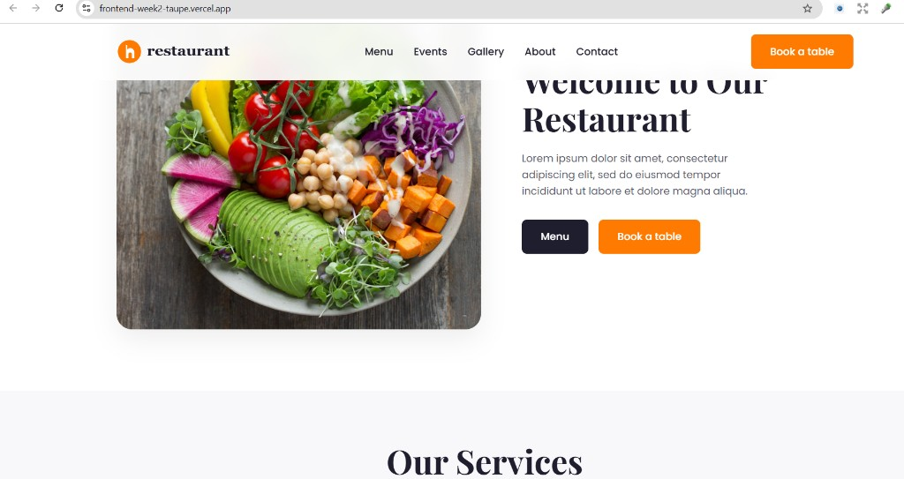
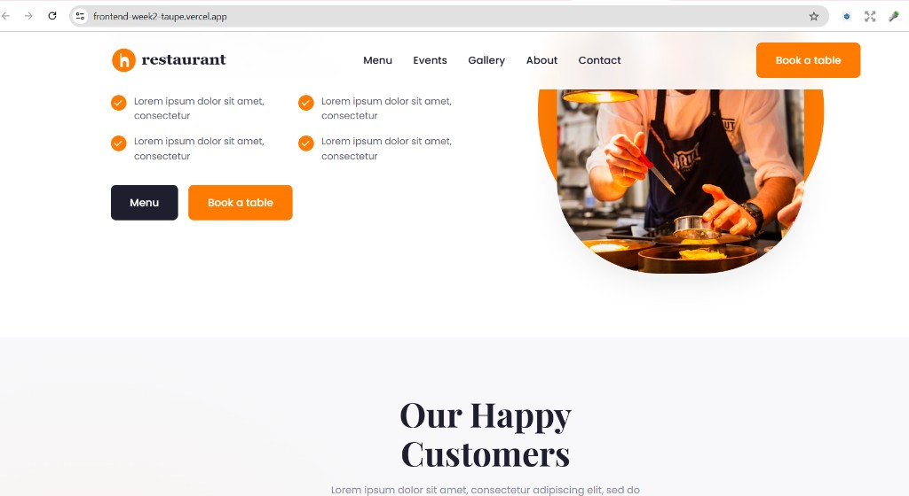
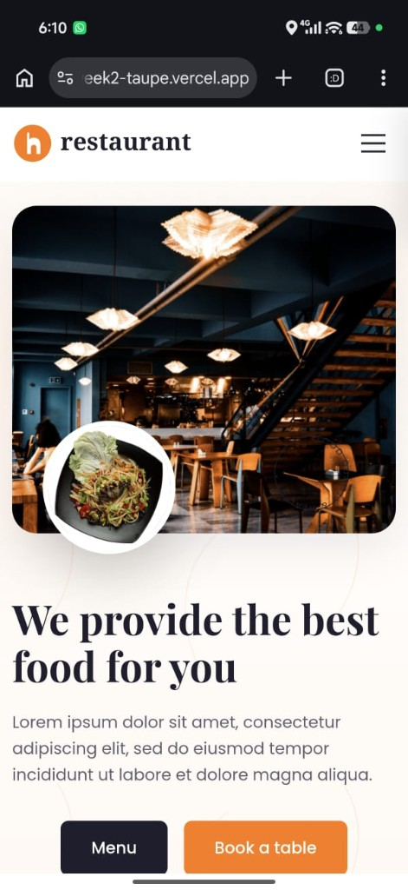
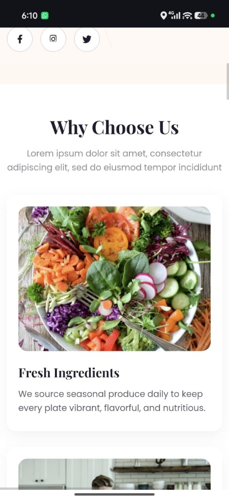
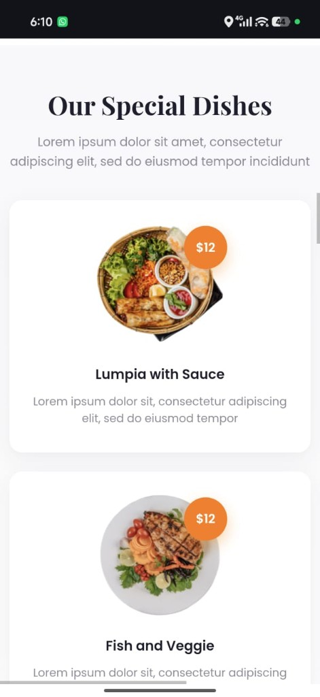
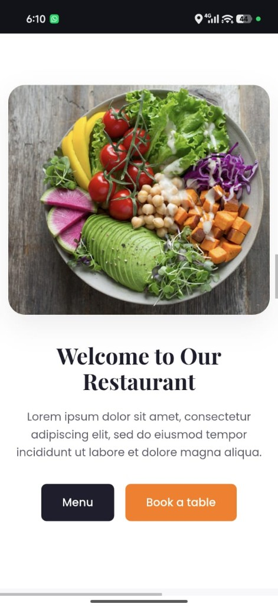

# Frontend Week 2 — Responsive Restaurant Landing Page

A pixel-inspired responsive restaurant landing page converted from the Figma Community design **[Restaurant website Landing Page Design](https://www.figma.com/design/QXfM5u0OgDfLkKcxE9WVbW/Restaurant-website-Landing-Page-Design--Community-)**.

Built with **HTML5 + CSS3 only** (no Bootstrap, Tailwind, JavaScript, or CSS frameworks).

## Live Demo

- **Vercel (live):** https://frontend-week2-taupe.vercel.app
- **Local preview:** open `index.html` in a browser

## Features

- Semantic HTML5 structure with accessibility-friendly landmarks and labels
- Sticky header with CSS-only mobile hamburger menu
- Hero, Features (3), Special Dishes / Menu (4), About, Services (4), Chef, Testimonials (3), Newsletter, Footer
- Flexbox + CSS Grid layouts
- Responsive breakpoints: Desktop (1920), Laptop (1440), Tablet (768), Mobile (375)
- CSS variables, transitions, hover effects, and light animations
- Smooth scrolling and sticky navigation (bonus)

## Folder Structure

```
Frontend-Week2/
├── index.html
├── css/
│   └── style.css
├── images/
├── assets/
│   ├── logo.svg
│   ├── screenshot-desktop.png
│   ├── screenshot-mobile.png
│   └── screenshots/
│       ├── desktop-hero.png
│       ├── desktop-features.png
│       ├── desktop-about.png
│       ├── desktop-chef.png
│       ├── mobile-hero.png
│       ├── mobile-features-1.png
│       ├── mobile-features-2.png
│       ├── mobile-dishes-1.png
│       ├── mobile-dishes-2.png
│       └── mobile-about.png
└── README.md
```

## Design Reference

- Figma: https://www.figma.com/design/QXfM5u0OgDfLkKcxE9WVbW/Restaurant-website-Landing-Page-Design--Community-
- Primary color: `#FF7A00`
- Dark: `#1E1E2E`
- Fonts: Playfair Display (headings), Poppins (body)

## Screenshots

### Desktop

| Hero | Features |
|------|----------|
|  |  |

| About | Chef / Testimonials |
|-------|---------------------|
|  |  |

### Mobile (375px)

| Hero | Features |
|------|----------|
|  |  |

| Special Dishes | About |
|----------------|-------|
|  |  |

## Getting Started

1. Clone the repository:
   ```bash
   git clone https://github.com/musfira62h-000/Frontend-Week2.git
   cd Frontend-Week2
   ```
2. Open `index.html` in your browser.

## Technical Stack

| Requirement | Status |
|-------------|--------|
| HTML5 | ✅ |
| CSS3 (external) | ✅ |
| Semantic HTML | ✅ |
| Flexbox & Grid | ✅ |
| Media Queries | ✅ |
| No CSS frameworks | ✅ |
| Responsive (1920 / 1440 / 768 / 375) | ✅ |

## Author

Internship Week 2 Assignment — Restaurant Landing Page
